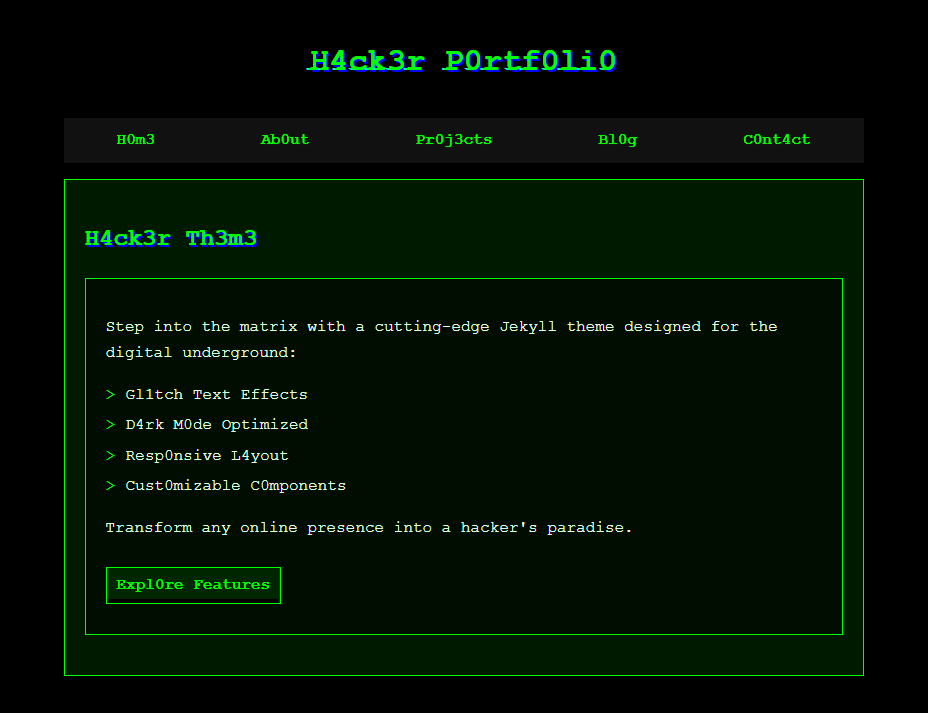
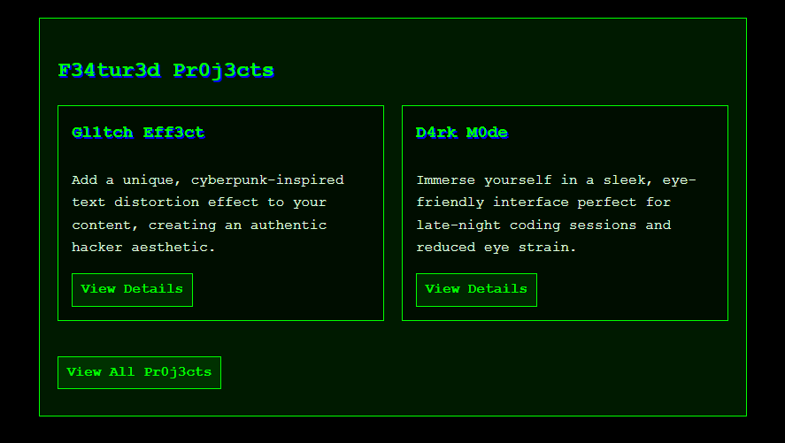
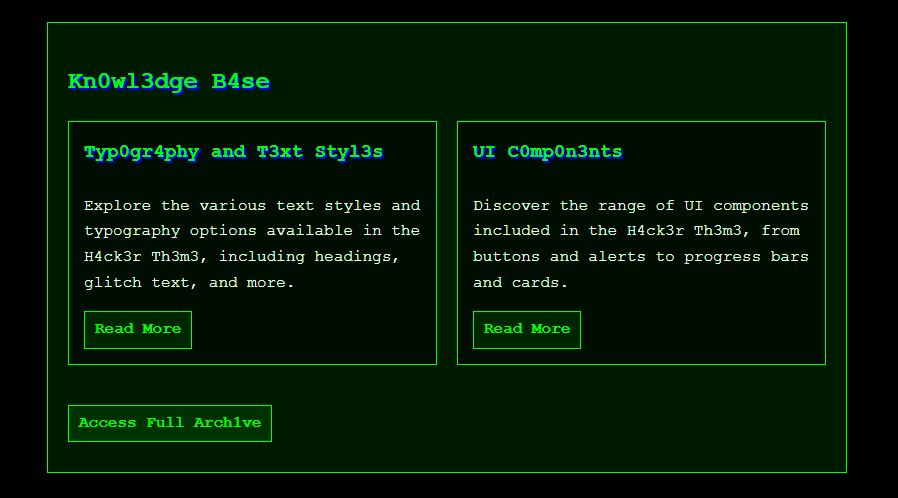
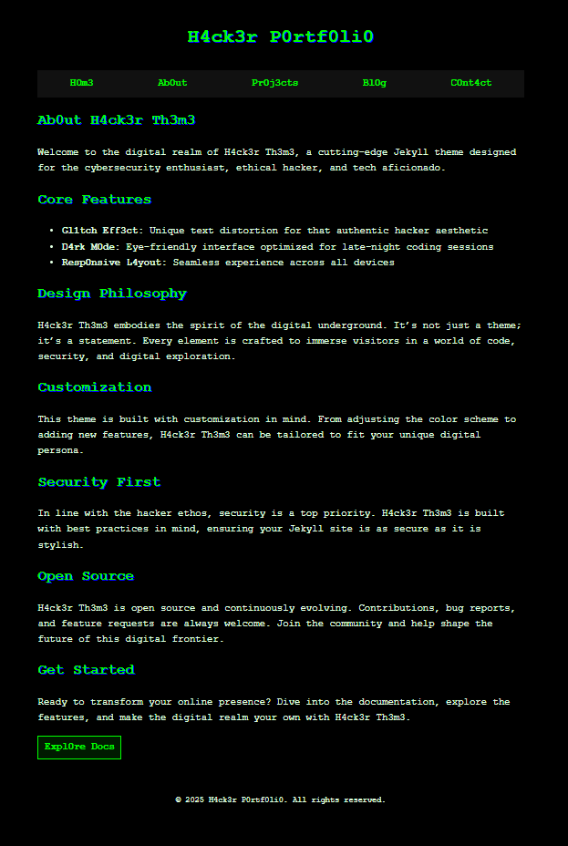
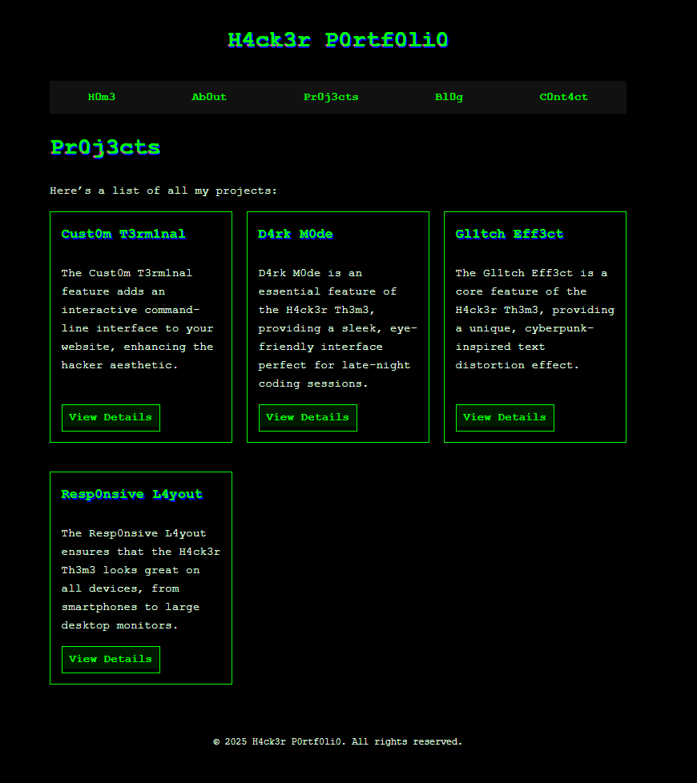
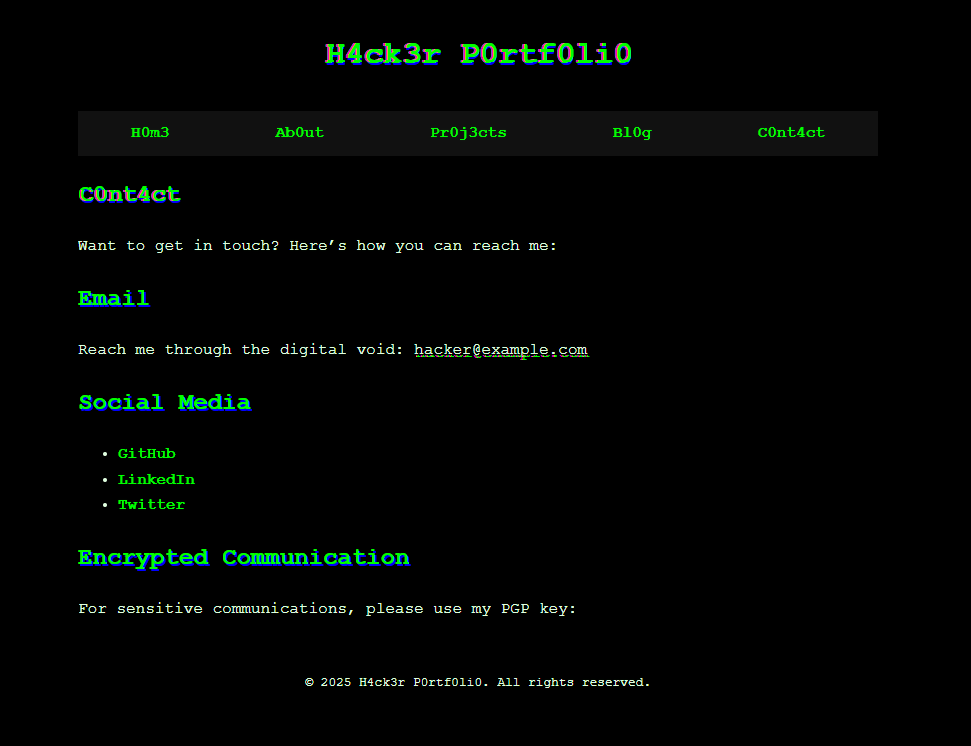
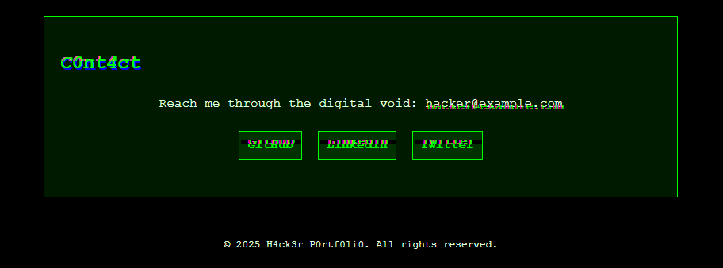

# H4ck3r Th3m3

H4ck3r Th3m3 is a cutting-edge Jekyll theme designed for cybersecurity enthusiasts, ethical hackers, and tech aficionados. It embodies the spirit of the digital underground, immersing visitors in a world of code, security, and digital exploration.

## Features

- **Gl1tch Eff3ct**: Unique text distortion for an authentic hacker aesthetic
- **D4rk M0de**: Eye-friendly interface optimized for late-night coding sessions
- **Resp0nsive L4yout**: Seamless experience across all devices
- **Customizable Components**: Easily modify colors, layouts, and features

## Installation

1. Clone the repository
2. Install dependencies
3. Run the development server

## Usage

1. Create posts in the `_posts` directory.
2. Create pages as needed.
3. Customize the theme by modifying `_sass` files.
4. Use included layouts: `default`, `home`, `page`, `post`, and `project`.

## Customization

- Modify color scheme in `_sass/_variables.scss`
- Add custom CSS in `assets/css/main.scss`
- Extend functionality with JavaScript in `assets/js/script.js`

## Contributing

Bug reports and pull requests are welcome on GitHub at https://github.com/IAmWilliamHames/h4ck3r-th3m3.

## License

The theme is available as open source under the terms of the [MIT License](https://opensource.org/licenses/MIT).

## Credits

H4ck3r Th3m3 was created by [@IAmWilliamHames](https://github.com/IAmWilliamHames) and is maintained by the open-source community.

## Screen Shots

